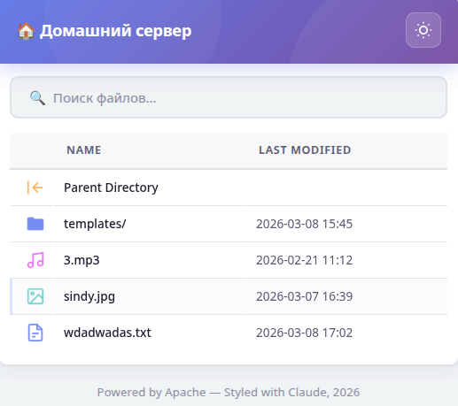
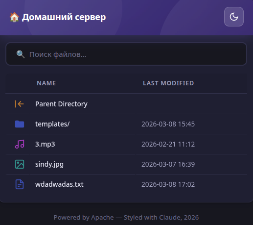

# <div align="center">

# 📁 Apache AutoIndex file directory

**Cовременный интерфейс для стандартного файлового листинга Apache**

<!-- скриншоты -->
| Light Mode | Dark Mode |
|:---:|:---:|
|  |  |

</div>

---

## ✨ Возможности

- 🌗 **Тёмная / Светлая тема** — автоопределение по системным настройкам + ручное переключение
- 🔍 **Поиск файлов** — мгновенная фильтрация в реальном времени
- 📤 **Загрузка файлов** — drag & drop или выбор через диалог, прогресс-бар, очередь файлов
- 🚀 **Без зависимостей** — чистый HTML + CSS + Vanilla JS, без фреймворков

## 📋 Требования

- **Apache HTTP Server** 2.4+
- **PHP** 7.4+
- Включённые модули:
  - `mod_autoindex`
  - `mod_dir`
  - `mod_mime`
- Разрешение использования `.htaccess` (`AllowOverride All`)

### Проверка модулей

```bash
# Проверить активные модули
apache2ctl -M | grep -E "autoindex|dir|mime"

# Включить модули (если не активны)
sudo a2enmod autoindex dir mime

# Перезапустить Apache
sudo systemctl restart apache2
```

---

## 📁 Структура проекта

```
/var/www/html/myServer/
├── основные файлы для обмена    ← файлы лежат здесь
├── .htaccess                    ← настройки Apache
├── .user.ini                    ← настройки PHP (лимиты загрузки)
└── templates/
    ├── style.css                ← стили интерфейса
    ├── header.html              ← шапка + зона загрузки
    ├── footer.html              ← подвал + весь JS
    ├── upload.php               ← обработчик загрузки файлов
    └── icons/                   ← SVG-иконки
```

---

## 📤 Загрузка файлов

Файлы загружаются через `templates/upload.php` и сохраняются прямо в корневую папку `/var/www/html/myServer/`.

### Настройка лимитов — `.user.ini`

Файл `.user.ini` лежит в корне (`/var/www/html/myServer/.user.ini`) и управляет ограничениями PHP:

```ini
upload_max_filesize = 2G    ; максимальный размер одного файла
post_max_size = 0           ; 0 = без лимита на весь запрос
max_execution_time = 0      ; 0 = без лимита по времени
max_file_uploads = 100      ; максимум файлов за один раз
memory_limit = -1           ; -1 = без лимита памяти
```

> ⚠️ `post_max_size` должен быть больше `upload_max_filesize`, либо `0` (без лимита).

После изменения `.user.ini` перезапустить Apache:
```bash
sudo systemctl restart httpd   # Fedora/RHEL
sudo systemctl restart apache2 # Debian/Ubuntu
```

---

<br>

# Мои заметки

## Базовая настройка

Если Apache уже настроен, достаточно создать папку для общего доступа:
```
/var/www/html/myServer/
```

Чтобы подключиться — узнать IP устройства:
```bash
ip addr show
```
Затем открыть в браузере: `http://192.168.0.23/myServer`

Apache по умолчанию слушает порт `80`, интерфейс `0.0.0.0`.

---

## SELinux (Fedora / RHEL)

На системах с SELinux Apache по умолчанию **не может писать** в директории, даже если права Unix (`rwxrwxrwx`) разрешают это.

Проверить контекст SELinux:
```bash
ls -Z /var/www/html/myServer/
```

Дать Apache право на запись:
```bash
sudo chcon -R -t httpd_sys_rw_content_t /var/www/html/myServer/
```

Проверить что SELinux не блокирует:
```bash
sudo tail -f /var/log/httpd/error_log
```

---

## Стили для Apache AutoIndex

Можно настроить кастомный интерфейс для стандартного листинга Apache.  
Для этого нужно:
1. Включить поддержку `.htaccess` в конфиге Apache
2. Создать файл `.htaccess` в папке
3. Подключить кастомные `header.html`, `footer.html`, `style.css`
